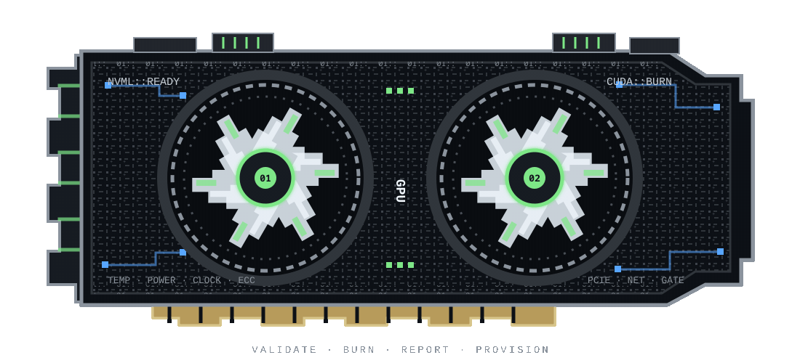

<div align="center">



# Arthur Perchatkin

### GPU Infrastructure · Linux Systems · Cloud Automation

I build systems that determine whether a GPU node is actually healthy enough to enter production.

[](https://github.com/arthurperch/gpu-validation)
[](https://www.linkedin.com/in/oleg-perchatkin-b90472161/)
[](mailto:olegperchatkin@gmail.com)

</div>

---

## `featured: gpu fleet onboarding`

My current project validates GPU hardware under real load, checks whether its host is network-ready, and sends the evidence to an independent control plane for a final decision.

```text
GPU NODE                                      CONTROL PLANE

NVML health ─┐
CUDA burn  ──┼─> combined JSON ─> API Gateway ─> Lambda policy ─> PROVISION
Network    ──┘                                      │            HOLD
                                                    └──────────> RMA
```

### [gpu-validation](https://github.com/arthurperch/gpu-validation) — node side

- Reads NVIDIA telemetry through **NVML**: temperature, power, clocks, VRAM, throttling, PCIe link state, serial data, and ECC capability.
- Compiles and runs a **CUDA burn workload** so a weak card cannot hide behind healthy idle readings.
- Validates **DHCP, IPv6, and ICMP** because working silicon on an unreachable node is not production-ready.
- Combines the results into a structured JSON report and submits it through one **Ansible** onboarding pipeline.
- Runs end to end against my local **RTX 3070**.

### [gpu-onboarding-gate](https://github.com/arthurperch/gpu-onboarding-gate) — control plane

- Receives node reports through **API Gateway**.
- Applies centralized **Lambda** policy instead of trusting a machine to approve itself.
- Stores an append-only validation trail in **DynamoDB**.
- Provisions the complete stack with **Terraform** and runs locally through **LocalStack**.

> The node reports. The gate decides. A node never declares itself healthy.

## `why the implementation matters`

| Engineering problem | Design decision |
| --- | --- |
| PCIe links downshift when bandwidth is not needed | Treat the static link reading conservatively, then verify it under CUDA load. |
| Consumer GPUs such as the RTX 3070 do not expose ECC | Report ECC as capability-aware `N/A`; do not crash or pretend the metric exists. |
| Idle telemetry can miss unstable hardware | Sample the card while the burn workload is active. |
| A compromised or failing node should not approve itself | Keep PROVISION / HOLD / RMA policy in an off-node control plane. |
| Manual validation does not scale across a fleet | Make the complete sequence repeatable through Ansible and machine-readable reports. |

## `toolchain`

<p align="center">
  
</p>

| Layer | Tools and concepts |
| --- | --- |
| **GPU** | NVIDIA NVML, CUDA, burn testing, telemetry sampling, PCIe, ECC awareness |
| **Systems** | Linux, drivers, networking, Bash, process and hardware troubleshooting |
| **Automation** | Python, Ansible, JSON pipelines, API integration |
| **Cloud** | AWS Lambda, API Gateway, DynamoDB, IAM, LocalStack |
| **Infrastructure** | Terraform, Docker, Git, repeatable build and teardown workflows |

## `other systems I build`

- [AWS Security Auditor](https://github.com/arthurperch/aws-security-auditor) — Python and Boto3 infrastructure checks across IAM, S3, EC2, CloudTrail, and security groups.
- [Active Directory on Azure](https://github.com/arthurperch/active-directory-azure-lab) — domain services, DNS, Group Policy, VNets, joined clients, and PowerShell automation.
- [iOS Fleet Management](https://github.com/arthurperch/ios-fleet-management) — physical-device enrollment, role-based MDM profiles, policy enforcement, and lifecycle operations.
- [Microsoft 365 Administration](https://github.com/arthurperch/Microsoft-365) — identity, licensing, Exchange troubleshooting, MFA, and Intune administration.

## `operating principles`

```text
01  Reproduce the failure before guessing.
02  Read the telemetry while the system is under load.
03  Automate repetition, not understanding.
04  Separate reported facts from policy decisions.
05  If I cannot explain the failure path, I do not understand it yet.
```

---

> ⚠️ **TEST** — the link below is a test only, not a project of mine.

[**rockstar**](https://github.com/avinassh/rockstar) — *"Makes you a Rockstar C++ Programmer in 2 minutes."*

<div align="center">

### Interested in GPU infrastructure, cloud operations, Linux systems, DevOps, and Python automation.

`arthur@cachyos ~ $` **validate → load → observe → decide → automate**


</div>
