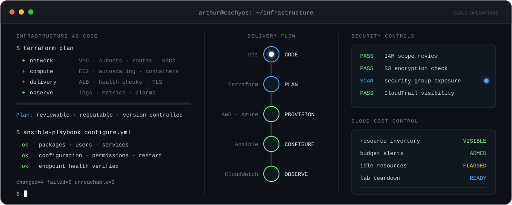

<div align="center">



# Arthur Perchatkin

**Cloud · DevOps · Linux · AWS · Azure · IaC**

I take source code to running infrastructure — then keep it observable, secure, repeatable, and cheap to run.

[](https://www.linkedin.com/in/oleg-perchatkin-b90472161/)
[](mailto:arthurperch98@gmail.com)
[](https://www.credly.com/badges/6cd055da-69f3-4966-b4ab-b92fe68fa50c)
[](https://www.credly.com/earner/earned/badge/126ff225-b7a0-4289-8b4b-88dffd75588a)

Pacific Northwest · open to cloud, DevOps, platform, and Linux roles

</div>

---

Linux-first. I work the seam where infrastructure, application code, automation, and operations meet.

| Layer | What I use |
| --- | --- |
| **Provision** | Terraform · AWS · Azure · VPC/VNet · EC2 · ECS Fargate · RDS · Lambda · API Gateway |
| **Configure** | Ansible · Bash · PowerShell · cloud-init · Linux services · Active Directory |
| **Build** | Python · TypeScript · React · Flask · FastAPI |
| **Ship** | Docker · ECR · GitHub Actions · Nginx · ALB · autoscaling |
| **Secure** | IAM · security groups · CloudTrail · Trivy · Checkov · RBAC |
| **Observe** | CloudWatch · logs · alarms · NVML telemetry · SQLite findings |
| **Cost** | LocalStack · inventory · budgets · teardown · remote state |

<p align="center">
  
</p>

## Selected builds

| Project | What it proves |
| --- | --- |
| **[AWS + Flask](https://github.com/arthurperch/Cloud-Infrastructure-Flask-App)** | Terraform VPC, public/private nets, EC2, ALB, autoscaling, IAM, S3 state, TLS, Nginx/Gunicorn, GitHub Actions |
| **[GPU validation](https://github.com/arthurperch/gpu-validation)** + **[onboarding gate](https://github.com/arthurperch/gpu-onboarding-gate)** | NVML + CUDA burn on-node; Lambda/API Gateway/DynamoDB decide `PROVISION` / `HOLD` / `RMA` off-node |
| **[AWS security auditor](https://github.com/arthurperch/aws-security-auditor)** | Boto3 checks across IAM, EC2, S3, SG, RDS, CloudTrail → JSON/HTML, Docker |
| **[E-commerce analytics](https://github.com/arthurperch/ecommerce-analytics-platform)** | FastAPI on ECS Fargate, RDS, ALB, Terraform, Trivy, Checkov |
| **[AD on Azure](https://github.com/arthurperch/active-directory-azure-lab)** | VNet/NSG, Windows Server 2022, AD DS, GPO, PowerShell identities, documented lab spend |
| **[Gridwatch](https://github.com/arthurperch/gridwatch)** | Live network rules → SQLite findings → SNS/webhook alerts |

<div align="center">

[Lab index](https://arthurperch.github.io/infrastructure-labs/) · [All public repos](https://github.com/arthurperch?tab=repositories)

</div>

## GPU node validation — one control-plane example

The node reports facts. The gate decides. A machine never approves itself.

```text
NVML health ─┐
CUDA burn  ──┼─> combined report ─> API Gateway ─> Lambda ─> PROVISION
Network    ──┘                                      │       HOLD
                                                    └─────> RMA
```

- Idle PCIe downshifts — treat static link as conservative, prove it under CUDA load.
- ECC is capability-aware (`N/A` on consumer silicon, counters on datacenter cards).
- One Ansible playbook: health → burn → network → reconcile → submit.



## How I work

```text
01  Reproduce the failure before guessing.
02  Read logs and telemetry before changing the system.
03  Automate repetition, not understanding.
04  Keep infrastructure reviewable and disposable.
05  Security, observability, and cost are design — not afterthoughts.
```

<div align="center">

**Build · Secure · Observe · Automate**


</div>
